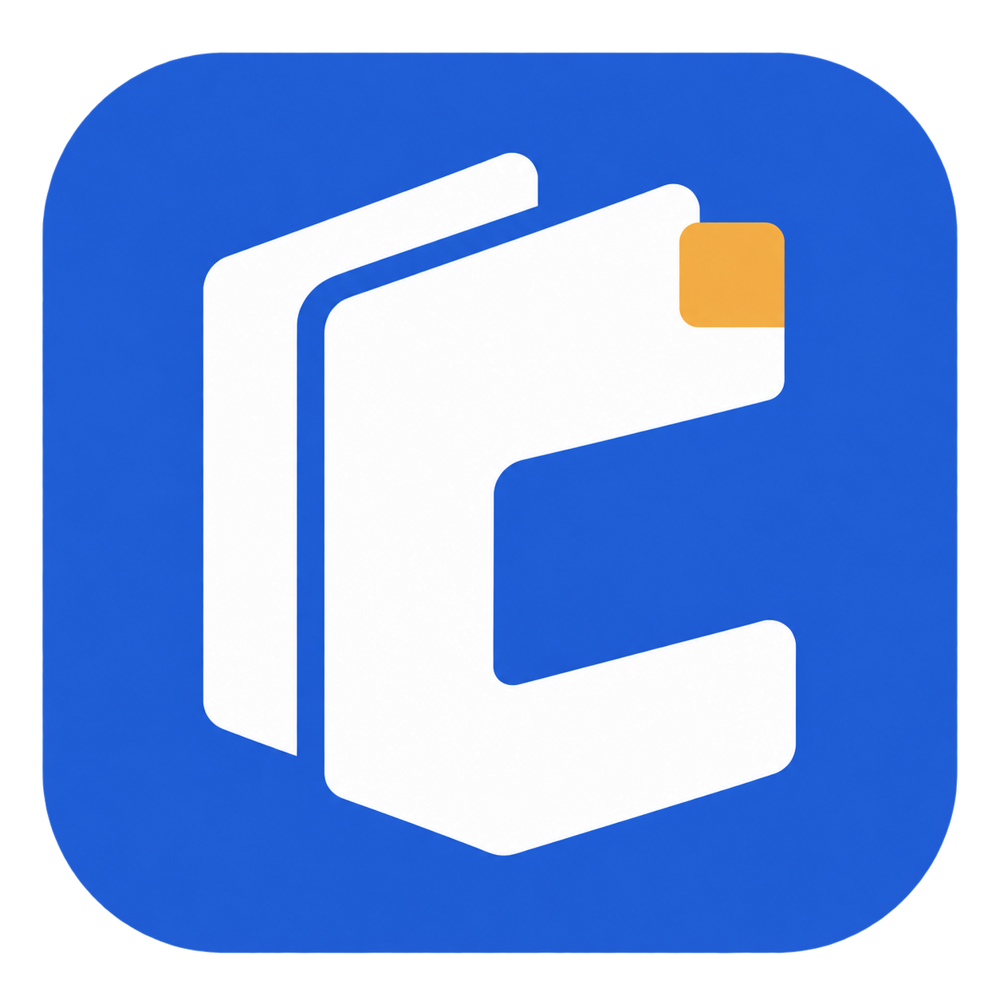
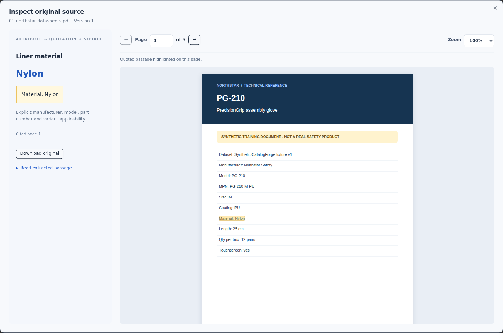
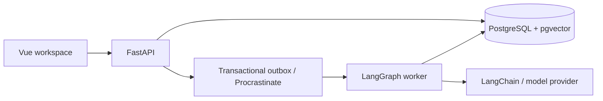

<p align="center">
  
</p>

<h1 align="center">CatalogForge</h1>

<p align="center">
  Product catalog enrichment with source evidence and explicit review.
</p>

<p align="center">
  <a href="#quick-start">Quick start</a> ·
  <a href="#workflow">Workflow</a> ·
  <a href="#architecture">Architecture</a> ·
  <a href="#evaluation">Evaluation</a> ·
  <a href="docs/README.md">Documentation</a>
</p>

CatalogForge turns product documents into attribute proposals that a reviewer can inspect and approve. It matches product identity, checks citations and keeps conflicting or unsupported values out of the approved catalog. Imported records remain intact.



*Evidence inspector with a fictional Northstar product from the included walkthrough.*

## Quick start

Requires Docker Engine, Docker Compose v2 with `--wait` support, and available ports `5288`, `8188` and `5488`. Run in Linux or WSL:

```bash
git clone https://github.com/andrewsrigom/catalogforge.git
cd catalogforge
[ -f .env ] || cp .env.example .env
docker compose up --build -d --wait
```

Open [localhost:5288](http://localhost:5288). The default `AI_MODE=fixture` requires no API key and makes no paid calls. An existing `.env` is preserved; check its mode before starting.

| Demo account | Access |
| --- | --- |
| `reviewer@catalogforge.local` | Review and edit |
| `viewer@catalogforge.local` | Read only |

Both accounts use `CatalogForge-demo-2026!`, the local password in [.env.example](.env.example). The **ForgeWorks · Synthetic demo** workspace includes 50 fictional products and five source documents. Wait for sources to become **Ready** before enriching products.

Compose binds services to loopback and stores the database and uploads in persistent volumes. API documentation is at [localhost:8188/api/docs](http://localhost:8188/api/docs). Stop the application without removing its data with `docker compose down`.

## Workflow

1. **Import:** upload a CSV, map its columns and select a category schema. Original values are preserved.
2. **Find evidence:** upload text-based PDFs, TXT or CSV sources, then select products and choose **Enrich selected**.
3. **Review:** compare proposals with their citations. Open the source document, resolve conflicts with a reason and keep unsupported fields unknown.
4. **Export:** create an immutable ZIP containing `catalog.csv`, `evidence.json` and review notes. Only original and approved values populate the catalog.

The local installation includes a [guided walkthrough](http://localhost:5288/walkthrough), [12 guided examples](http://localhost:5288/examples) and a [product overview](http://localhost:5288/product-story). Examples cover conflicting suppliers, similar variants, unit conversion, missing information and malicious instructions in documents.

## Architecture



| Component | Role |
| --- | --- |
| Vue 3, TypeScript, TanStack Query | Catalog, review, source inspection and execution history |
| FastAPI, Pydantic, SQLAlchemy | Contracts, authentication, workspace permissions and transactions |
| PostgreSQL, pgvector | Versioned records, evidence, lexical/vector retrieval and checkpoints |
| LangGraph, Procrastinate | Durable workflows, review interrupts, retries and resumption |
| LangChain | Document processing, embeddings, retrieval tools and structured model output |

Proposals, imported values and approved revisions are stored separately. Jobs may be delivered more than once; version checks and idempotent operations prevent decisions from being applied twice. See [Architecture](docs/ARCHITECTURE.md) for transaction boundaries, authorization and recovery semantics.

## AI modes

- **Fixture:** deterministic behavior for the included synthetic records, using the same graphs, database and review workflow. It does not extract arbitrary documents.
- **Real:** OpenAI chat and embeddings with structured output, identity checks and citation validation. Provider failures are surfaced without silently switching to fixtures.

The recorded evaluation used `gpt-4.1-mini` and `text-embedding-3-small`. Models are configured separately. In real mode, product context and document passages are sent to the provider; call, token and optional USD limits are tracked persistently.

Use [.env.pilot.example](.env.pilot.example) and the [isolated pilot guide](docs/AI_READINESS.md#isolated-pilot) for live configuration. The pilot has separate data and keeps its worker off by default. Keep credentials in local environment files.

## Evaluation

Recorded on **2026-09-16**, with deterministic checks separated from live-model evaluation.

| Check | Result | Scope |
| --- | --- | --- |
| Automated tests | 129 passed | 117 backend, 6 unit and 6 browser journeys |
| Fixture attribute checks | 319/319 | 50 baseline products and 12 guided examples |
| Live precision | 37/38 — 97.4% | 10 held-out products |
| Live coverage | 37/39 — 94.9% | Answerable fields in the same held-out set |
| Worker recovery | 47.36 s | One SIGKILL during approval; change applied once |

The real corpus contains 30 Portwest products, split into 20 development and 10 held-out cases. Twelve synthetic adversarial cases are evaluated separately. The held-out set ran once after inference code and prompts were frozen.

The held-out run produced one incorrect proposal; two adversarial unit-conversion cases were left unknown. The sample covers one manufacturer and category, and its labels have no independent expert review. Fixture results measure integration, not model quality.

[Evaluation report](docs/RELEASE_REVIEW.md) · [Machine-readable results](docs/verification/release/results.json) · [Reproduction commands](docs/DEVELOPMENT.md#tests-and-evaluation)

## Scope and limits

- Text-based PDFs only, up to 20 MB and 200 pages; no OCR or encrypted PDFs.
- Source identity and quotations are checked, but a citation does not prove that a document is correct. Approval remains an explicit user decision.
- Local deployment and one evaluated product category. No production-load benchmark or automatic publication to external catalogs.
- Reindexing and demo reset require administrative write downtime.

See [Limitations](docs/LIMITATIONS.md) for document handling, authentication and operational constraints.

## Documentation

- [Development](docs/DEVELOPMENT.md): Python/Node setup, tests, generated API types and maintenance.
- [Operations](docs/AI_READINESS.md): provider configuration, usage limits, backup and restore.
- [Documentation index](docs/README.md): design decisions and verification records.

## License

[MIT](LICENSE) for code and synthetic examples. Dependencies and external documents retain their own licenses. Manufacturer PDFs are not included; evaluation datasets record source URLs and hashes.
